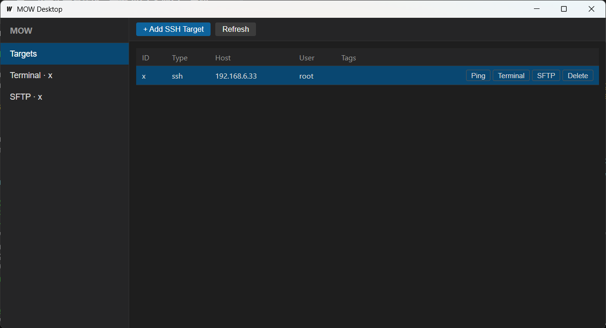

<div align="center">

# Modern Operations Workspace（MOW）

**AI is optional. Automation is essential.**

一款 AI Native，但**不依赖 AI** 的现代化跨平台运维工作台。

`Core First` · `AI Optional` · `Plugin Everything`

[](./LICENSE)
[](./Architecture.md)
[](https://go.dev)
[](https://wails.io)

</div>

---

## 项目定位

MOW 是一款面向**开发者与运维工程师**的跨平台运维工作台：

- 无论 AI 是否可用，本软件都具备完整的运维能力
- 即使完全不接入 AI，它依然是一款优秀的 **SSH / Docker / PVE** 运维工具
- 接入 AI 后，只是让操作更智能、更高效

> **Core 永远不依赖 AI，AI 永远依赖 Core。**

## 核心特性

- 🖥️ **跨平台**：Windows / Linux / macOS 一致体验
- 🔌 **Plugin Everything**：SSH / Docker / PVE / K8s / AI 都是插件
- ⚙️ **统一执行链路**：GUI / CLI / AI / API 全部走同一 Command Engine
- 📜 **Recipe & Workflow**：把运维经验沉淀为可复用、可编排的资产
- 🔐 **Safety First**：所有 Command 声明权限，危险操作强制二次确认
- 📊 **完全可观测**：审计、回放、AI 决策链路可追溯

## 技术栈

| 层 | 选型 |
| --- | --- |
| Core | Go 1.25+ |
| 桌面客户端 | Wails v2 + React + TypeScript + xterm.js + shadcn/ui |
| CLI | Cobra |
| Plugin 加载 | [hashicorp/go-plugin](https://github.com/hashicorp/go-plugin)（gRPC 子进程） |
| 配置 / 日志 | Viper + `log/slog` |
| 仓库布局 | Monorepo + `go.work` |

## 目录结构

```
├── docs/            # 架构总纲与各模块 RFC（16 篇）
├── apps/
│   ├── desktop/     # Wails 桌面客户端（Terminal / SFTP / Targets）
│   └── cli/         # Cobra CLI（target / ssh / run / recipe）
├── core/            # Core 模块（7 子包：包含 workflow）
│   ├── command/     # Command Engine + Middleware + Audit
│   ├── connection/  # Connection Manager + Keystore
│   ├── plugin/      # Plugin Manager + Loader
│   ├── recipe/      # Recipe Registry + Runner
│   ├── workflow/    # Workflow YAML DSL + Runner + ${var} 插值（v0.2）
│   ├── config/      # 配置管理
│   └── logger/      # 结构化日志
├── sdk/             # Plugin SDK（gRPC + Protobuf + Go 抽象）
├── plugins/
│   └── ssh/         # 官方 SSH Plugin（exec / shell / sftp / ping）
├── examples/
│   ├── recipes/
│   └── workflows/   # deploy-static-site.yaml 等示例
├── tests/
│   └── e2e/         # 端到端测试（含 workflow_e2e_test.go）
└── scripts/         # lint / race / CI 脚本
```

## 文档

- 📘 [Architecture.md](./Architecture.md) — 架构总纲
- 📁 [docs/](./docs) — 各模块 RFC 索引
  - [vision](./docs/vision.md) · [design principles](./docs/design-principles.md) · [architecture](./docs/architecture.md)
  - [command engine](./docs/command-engine.md) · [recipe](./docs/recipe.md) · [workflow](./docs/workflow.md)
  - [plugin system](./docs/plugin-system.md) · [ssh plugin](./docs/ssh-plugin.md) · [connection manager](./docs/connection-manager.md)
  - [permission](./docs/permission.md) · [observability](./docs/observability.md) · [ai](./docs/ai.md) · [ui](./docs/ui.md)
  - [roadmap](./docs/roadmap.md) · [v0.1 acceptance checklist](./docs/v0.1-acceptance-checklist.md) · [v0.2 acceptance checklist](./docs/v0.2-acceptance-checklist.md) · [v0.3 acceptance checklist](./docs/v0.3-acceptance-checklist.md)

## 快速开始

### 环境要求

- Go 1.25+
- Node.js 18+（仅桌面端）
- [Wails CLI](https://wails.io/docs/gettingstarted/installation)（仅桌面端）

### 运行

```powershell
# 1. 编译 SSH 插件
cd plugins/ssh
go build -o ssh.exe .

# 2. 启动 CLI
cd ..\..\apps\cli
go run . --help                  # 查看帮助
go run . target add my-server \  # 添加 SSH 目标
  --host 192.168.1.100 \
  --port 22 \
  --user root \
  --password mypass
go run . ssh my-server           # 交互式 SSH Shell
go run . run my-server uptime    # 单次执行命令

# v0.2：执行一个 Workflow（YAML DSL）
go run . workflow validate ..\..\examples\workflows\deploy-static-site.yaml
go run . workflow run ..\..\examples\workflows\deploy-static-site.yaml `
  --target=my-server `
  --input site=hello `
  --input local_dir=C:\dist `
  --input remote_dir=/var/www/hello `
  --input health_port=8080

# 3. 启动桌面客户端
cd ..\desktop
wails dev

# 4. 运行全部测试
cd ..\..\tests\e2e
$env:MOW_SSH_PLUGIN = "../../plugins/ssh/ssh.exe"
go test -count=1 ./...
```

### 运行截图



### v0.1 交付状态

| 模块 | 文件 | 测试数 | 状态 |
|------|------|--------|------|
| Core | 18 文件 / 2,317 行 | 47 PASS | 已交付 |
| SDK | 13 文件 / 1,878 行 | — | 已交付 |
| SSH Plugin | 6 文件 / 1,436 行 | 12 UT + 10 E2E | 已交付 |
| CLI | 10 文件 / 1,249 行 | — | 已交付 |
| Desktop | 3 Go + 3 TSX | — | 已交付 |
| SFTP E2E | 新增 | 9 E2E | 已交付 |
| Shell E2E | 新增 | 4 E2E | 已交付 |
| 文档 | 16 篇 | — | 已交付 |

**自动化测试通过：76/76 | E2E 通过：23/23 | 手动验收：42/42**  
详见 [v0.1 验收清单](./docs/v0.1-acceptance-checklist.md)

## Roadmap

| 版本 | 目标 | 状态 |
| --- | --- | --- |
| **v0.1** | 优秀的 SSH 客户端 + Plugin Framework 雏形（不接入 AI） | ✅ 已发布 |
| **v0.2** | Command / Recipe / Workflow Engine（YAML DSL + `${var}` 插值 + Runner） | ✅ 已发布 |
| **v0.3** | Docker Plugin + Docker Dashboard + Workflow 增强（parallel / when / on_failure / retry / rollback / 执行历史 JSONL） | 🎯 RC 就绪，待发布 |
| **v0.3.1** | 稳定性补丁：Docker 覆盖率 76.0% · JSONL 轮转+跨进程锁 · Windows npipe（go-winio） · TLS exec raw-hijack · Docker E2E 接入 CI | ✅ 全部完成 |
| **v0.4** | AI Plugin + Provider 抽象（含 MCP 支持） | 📋 计划中 |
| **v0.5** | PVE / K8s / DB Plugin + Marketplace 雏形 | 📋 计划中 |

详见 [docs/roadmap.md](./docs/roadmap.md)。

## 参与贡献

欢迎所有形式的贡献——**尤其欢迎新的 Plugin**。请先阅读 [CONTRIBUTING.md](./CONTRIBUTING.md)。

## 设计原则速览

| 原则 | 说明 |
| --- | --- |
| Core First | 核心能力先于 UI |
| AI Optional | AI 是可选能力 |
| Plugin Everything | 新能力优先做成插件 |
| Workflow over Script | 沉淀为可复用 Workflow |
| API First | Core 对外统一 API |
| Safety First | 危险操作强制二次确认 |
| Observable | 可追踪、可审计、可回放 |
| Domain Driven | 抽象领域模型，而非 Shell |

## License

Licensed under the [Apache License, Version 2.0](./LICENSE).
